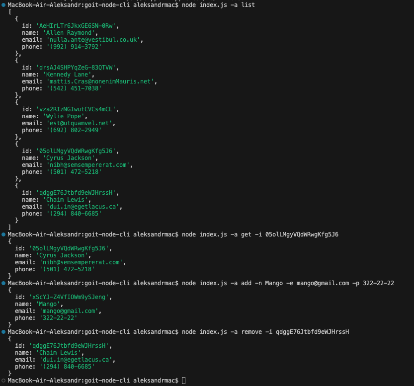

# Проект GoIT Node CLI

## Описание

Это проект для управления контактами через командную строку (CLI). Он позволяет добавлять, удалять, получать и списывать контакты.

## Установка

1. Клонируйте репозиторий.
2. Установите зависимости:
   npm install

## Использование

1. Вывод всех контактов:

   node index.js -a list

2. Получение контакта по ID:

   node index.js -a get -i <contact-id>

3. Добавление нового контакта:

   node index.js -a add -n "Имя" -e "email@example.com" -p "123-456-789"

4. Удаление контакта по ID:

   node index.js -a remove -i <contact-id>
